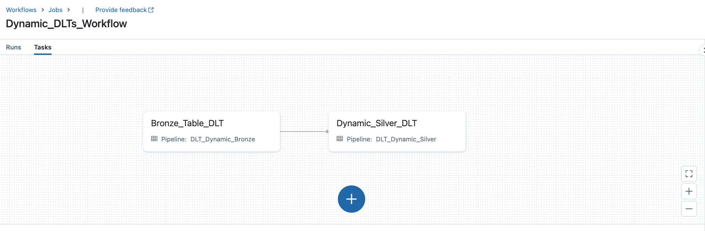

# Demo: Dynamic Delta Live Tables Definition

## Problem statement
---
In this demo, we want to tackle a common use case where one may have a single event producer (or data source) that is shared across different BUs or types of 
events, and the first step to give consuming teams control over their own data is to split the data feed and apply standard treatments across the data set using an attribute as filter for each BU/event type.
That issue could easilt produce lots of duplicate code and/or become complex to maintain as the number of BUs/event types escalate, and would require a deploy/parameter change for each new consumer, by defining the silver layer dynamically, we can keep the code concise and dynamic, in order to addapt to incoming changes in the data feed.

## What is in this demo
---
- 3 Python notebooks
  1. `01_Data_Generator.py` -> This notebook generates dummy IoT data for 11 wind turbines and a weather sensors (those will be our breakdowns)
  2. `02_DLT_Dynamic_Bronze_Table.py` -> Defines the Bronze Table pipeline (a single bronze table for all the data in the incoming feed)
  3. `03_DLT_Dynamic_Silver_Tables.py` -> Iterates over the split attribute column and creates a table for each distinct element in that column (other common treatments such as data hashing, type conversion and so on could be applied for all tables at once as well)
- 3 jsons under `config_jsons/`
  1. `01_DLT_Dynamic_Bronze_Pipeline.json` -> Defines the bronze layer pipeline (single table for all incoming data)
  2. `02_DLT_Dynamic_Silver_Pipeline.json` -> Defines the silver layer pipeline (that has as many tables as we have distinct values on the key column)
  3. `03_Workflow_definition.json` -> Defines a 2 task workflow (image bellow) that will tie up our 2 DLT Pipelines and define the silver layer dynamically

## Visual representation of the workflow
---

